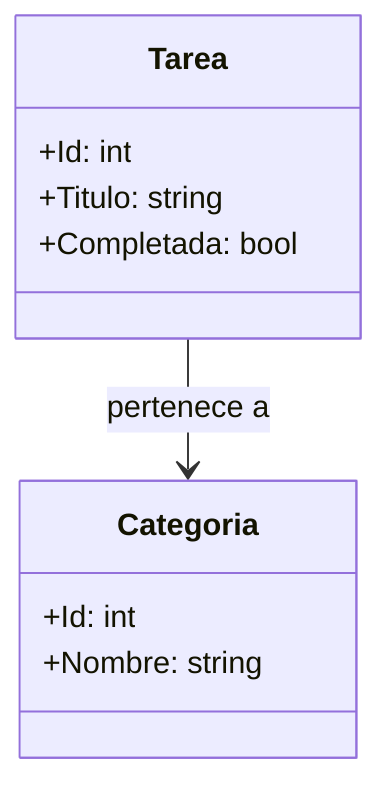

# Documentación con Markdown y Mermaid

Usa esta skill cuando quieras explicar clases, componentes o módulos de forma clara y visual.

## Objetivo
Crear documentación profesional en Markdown que incluya:
- resumen de la clase o módulo
- responsabilidades principales
- dependencias o relaciones
- un diagrama Mermaid embebido en bloque de código

## Reglas de salida
1. Responde siempre en Markdown.
2. Incluye un bloque Mermaid con `mermaid` cuando sea relevante.
3. Si se te indican clases, usa sus nombres reales y describe relaciones entre ellas.
4. Si no tienes suficiente contexto, pregunta primero qué clases o archivos quieres documentar.
5. Mantén el lenguaje claro, breve y técnico.
6. Agrega fecha y hora de generación al final del documento.
7. Versiona el documento siempre que se actualice, indicando la fecha y hora de la última modificación., y la version
8. Incluye un resumen ejecutivo al inicio, y un cierre con observaciones útiles al final.
9. Si el usuario solicita un diagrama Mermaid, genera un bloque de código con `mermaid` y usa `classDiagram` para representar las clases y sus relaciones.

## Estructura recomendada

### 1. Título
- Nombre del módulo o clases documentadas.

### 2. Resumen
- Explicación breve del propósito general.

### 3. Diagrama Mermaid
- Usa `classDiagram` para clases y relaciones.
- Ejemplo:

### 4. Descripción de clases
- Lista de responsabilidades, propiedades y métodos clave.

### 5. Relaciones y dependencias
- Explica cómo interactúan las clases.

### 6. Observaciones
- Añade notas de diseño, riesgos o recomendaciones si aplica.

## Buenas prácticas
- Usa nombres de clases en PascalCase.
- Mantén los diagramas legibles, no sobrecargues con demasiadas clases.
- Si el proyecto es C#, menciona conceptos como servicios, repositorios, modelos y formularios cuando corresponda.
- Prioriza claridad sobre detalle excesivo.

## Instrucción final para el modelo
Cuando el usuario pida documentar clases, genera:
1. un resumen ejecutivo,
2. un diagrama Mermaid embebido,
3. una explicación por clase,
4. y un cierre con observaciones útiles.
