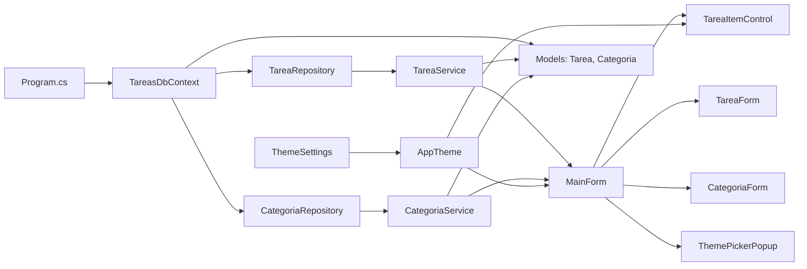

# Diagrama completo de la aplicación DemoTareas

## Resumen ejecutivo
Esta aplicación Windows Forms en .NET 10 gestiona tareas personales con categorías, prioridad, fecha de vencimiento y tema visual. El diagrama siguiente muestra la arquitectura real del proyecto: formularios de interfaz, servicios de negocio, repositorios de datos, modelos de dominio y la inicialización de la aplicación.

## Diagrama general de arquitectura

## Diagrama de clases y relaciones

```mermaid
classDiagram
    class Program {
        +Main()
    }

    class TareasDbContext {
        +DbSet~Tarea~ Tareas
        +DbSet~Categoria~ Categorias
        +OnConfiguring()
        +OnModelCreating()
    }

    class ITareaRepository {
        +GetAll()
        +GetById(id)
        +Add(tarea)
        +Update(tarea)
        +Delete(id)
    }

    class TareaRepository {
        +GetAll()
        +GetById(id)
        +Add(tarea)
        +Update(tarea)
        +Delete(id)
    }

    class ICategoriaRepository {
        +GetAll()
        +GetById(id)
        +GetByNombre(nombre)
        +Add(categoria)
        +Update(categoria)
        +Delete(id)
    }

    class CategoriaRepository {
        +GetAll()
        +GetById(id)
        +GetByNombre(nombre)
        +Add(categoria)
        +Update(categoria)
        +Delete(id)
    }

    class ITareaService {
        +GetAll()
        +GetFiltered(estado, categoriaId, prioridad)
        +Add(tarea)
        +Update(tarea)
        +Delete(id)
        +ToggleComplete(id)
    }

    class TareaService {
        +GetAll()
        +GetFiltered(estado, categoriaId, prioridad)
        +Add(tarea)
        +Update(tarea)
        +Delete(id)
        +ToggleComplete(id)
    }

    class ICategoriaService {
        +GetAll()
        +Add(nombre)
        +Update(id, nuevoNombre)
        +Delete(id)
    }

    class CategoriaService {
        +GetAll()
        +Add(nombre)
        +Update(id, nuevoNombre)
        +Delete(id)
    }

    class MainForm {
        -ITareaService _tareaService
        -ICategoriaService _categoriaService
        +RefrescarGrid()
        +RefrescarFiltros()
        +CrearNuevaRapida()
        +AbrirCategorias()
    }

    class TareaForm {
        -ICategoriaService _categoriaService
        +Tarea Tarea
        +BtnGuardar_Click()
    }

    class CategoriaForm {
        -ICategoriaService _categoriaService
        +RefrescarLista()
        +BtnAnadir_Click()
        +BtnEditar_Click()
        +BtnEliminar_Click()
    }

    class TareaItemControl {
        -Tarea _tarea
        -ITareaService _tareaService
        +ToggleRequested
        +EditRequested
        +DeleteRequested
    }

    class ThemePickerPopup {
        +Show()
    }

    class AppTheme {
        +Palette
        +AccentColor
        +ApplyTheme(name)
        +ApplyFlatButton(button, primary)
        +DrawCircularCheckbox(graphics, bounds, isChecked)
    }

    class ThemeSettings {
        +Load()
        +Save(themeName)
    }

    class Tarea {
        +int Id
        +string Titulo
        +string? Descripcion
        +EstadoTarea Estado
        +Prioridad Prioridad
        +DateTime FechaCreacion
        +DateOnly? FechaVencimiento
        +int? CategoriaId
        +Categoria? Categoria
    }

    class Categoria {
        +int Id
        +string Nombre
        +ICollection~Tarea~ Tareas
    }

    class EstadoTarea
    class Prioridad

    Program --> TareasDbContext
    Program --> TareaRepository
    Program --> CategoriaRepository
    Program --> TareaService
    Program --> CategoriaService
    Program --> MainForm

    TareasDbContext --> Tarea
    TareasDbContext --> Categoria

    TareaRepository ..|> ITareaRepository
    CategoriaRepository ..|> ICategoriaRepository
    TareaService ..|> ITareaService
    CategoriaService ..|> ICategoriaService

    TareaService --> ITareaRepository
    CategoriaService --> ICategoriaRepository

    MainForm --> ITareaService
    MainForm --> ICategoriaService
    MainForm --> TareaItemControl
    MainForm --> TareaForm
    MainForm --> CategoriaForm
    MainForm --> AppTheme
    MainForm --> ThemePickerPopup

    TareaForm --> ICategoriaService
    TareaForm --> Tarea

    CategoriaForm --> ICategoriaService
    CategoriaForm --> Categoria

    TareaItemControl --> Tarea
    TareaItemControl --> ITareaService

    Tarea --> Categoria
    Categoria --> Tarea
    Tarea --> EstadoTarea
    Tarea --> Prioridad

    ThemeSettings --> AppTheme
```

## Descripción de los componentes principales
- Program.cs: inicia la aplicación, crea el DbContext, seed de datos y construye los servicios y la ventana principal.
- MainForm: pantalla principal con filtros, lista de tareas y acceso a crear, editar y gestionar categorías.
- TareaForm: formulario modal para crear o editar una tarea con su categoría, prioridad y vencimiento.
- CategoriaForm: formulario para añadir, editar y eliminar categorías.
- TareaItemControl: representación visual de una tarea dentro del listado principal.
- TareaService y CategoriaService: validan reglas de negocio y coordinan acceso a datos.
- TareaRepository y CategoriaRepository: encapsulan las operaciones sobre SQLite mediante EF Core.
- TareasDbContext: define la base de datos y las relaciones entre tareas y categorías.
- Models: representan el dominio de la aplicación.
- AppTheme y ThemeSettings: gestionan la apariencia visual y la persistencia del tema.

## Relaciones clave
- Una tarea pertenece a una categoría opcional.
- Las tareas se filtran en MainForm mediante estado, categoría y prioridad.
- Los servicios validan reglas antes de persistir cambios.
- Los formularios se comunican con la capa de servicios y no acceden directamente a la base de datos.

## Observaciones
- El diseño mantiene una separación clara entre UI, negocio y persistencia.
- El flujo de datos es guiado por servicios, lo que facilita pruebas y mantenimiento.
- El diagrama refleja la estructura real del proyecto actual en Windows Forms con .NET 10.

## Generado el
- Fecha: 2026-06-16
- Hora: 2026-06-16 00:00
- Versión: 1.0
