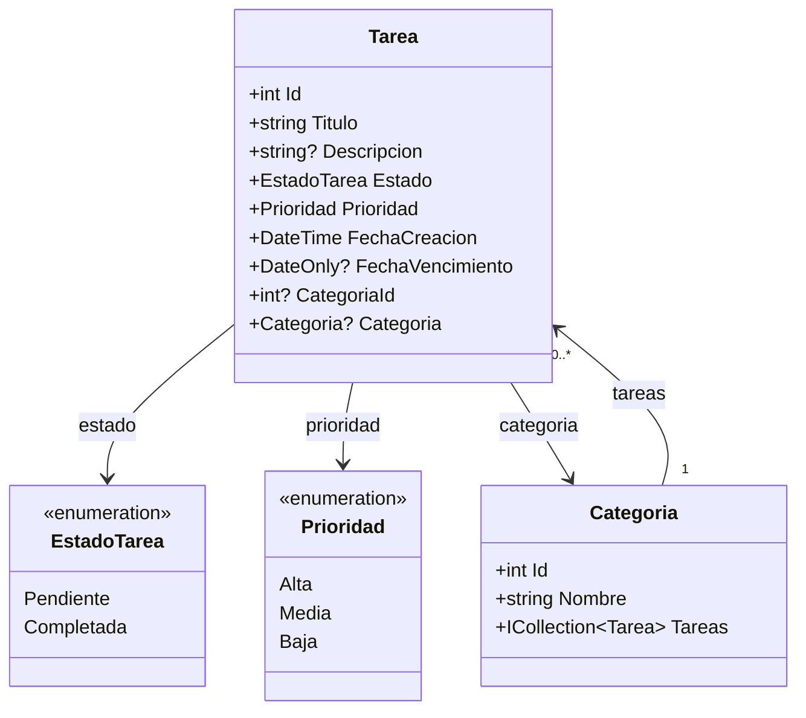

# Modelo de tareas

## Resumen
El modelo principal de la aplicación representa cada tarea con su estado, prioridad, fechas y categoría asociada. Esta estructura permite gestionar la lista de trabajo de forma clara y separada de la interfaz de usuario, y está preparada para usarse desde servicios, repositorios y Entity Framework Core.

## Diagrama Mermaid

## Descripción de clases

### Tarea
Representa una tarea del usuario.
- `Id`: identificador único.
- `Titulo`: nombre de la tarea; valor inicial vacío.
- `Descripcion`: detalle opcional.
- `Estado`: valor de `EstadoTarea`; por defecto se inicia en `Pendiente`.
- `Prioridad`: valor de `Prioridad`; por defecto se inicia en `Media`.
- `FechaCreacion`: fecha de creación; por defecto se asigna con `DateTime.UtcNow`.
- `FechaVencimiento`: fecha límite opcional.
- `CategoriaId`: clave foránea opcional hacia una categoría.
- `Categoria`: navegación opcional hacia la categoría relacionada.

### Categoria
Agrupa tareas por clasificación.
- `Id`: identificador único.
- `Nombre`: nombre de la categoría; valor inicial vacío.
- `Tareas`: colección de tareas asociadas, representada como `ICollection<Tarea>`.

### EstadoTarea
Enumeración del ciclo de vida de la tarea.
- `Pendiente`
- `Completada`

### Prioridad
Enumeración de la importancia de la tarea.
- `Alta`
- `Media`
- `Baja`

## Relaciones y dependencias
- Una `Tarea` puede pertenecer a cero o una `Categoria` mediante `CategoriaId` y `Categoria`.
- Una `Categoria` puede contener muchas `Tarea` mediante `ICollection<Tarea>`.
- La entidad `Tarea` depende de las enumeraciones `EstadoTarea` y `Prioridad` para definir su estado y relevancia.
- El modelo no define lógica de negocio propia; solo describe la estructura de datos que consumen servicios y repositorios.

## Observaciones
Este modelo es simple, legible y adecuado para usarlo desde servicios, repositorios y formularios de Windows Forms. Además, incorpora valores por defecto realistas para que la entidad pueda instanciarse de inmediato en la aplicación.
